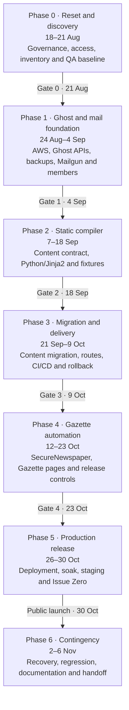

## Roadmap

```mermaid
flowchart TD
    P0["Phase 0 · Reset and discovery<br/>18–21 Aug<br/>Governance, access, inventory and QA baseline"]
    P1["Phase 1 · Ghost and mail foundation<br/>24 Aug–4 Sep<br/>AWS, Ghost APIs, backups, Mailgun and members"]
    P2["Phase 2 · Static compiler<br/>7–18 Sep<br/>Content contract, Python/Jinja2 and fixtures"]
    P3["Phase 3 · Migration and delivery<br/>21 Sep–9 Oct<br/>Content migration, routes, CI/CD and rollback"]
    P4["Phase 4 · Gazette automation<br/>12–23 Oct<br/>SecureNewspaper, Gazette pages and release controls"]
    P5["Phase 5 · Production release<br/>26–30 Oct<br/>Deployment, soak, staging and Issue Zero"]
    P6["Phase 6 · Contingency<br/>2–6 Nov<br/>Recovery, regression, documentation and handoff"]

    P0 -->|"Gate 0 · 21 Aug"| P1
    P1 -->|"Gate 1 · 4 Sep"| P2
    P2 -->|"Gate 2 · 18 Sep"| P3
    P3 -->|"Gate 3 · 9 Oct"| P4
    P4 -->|"Gate 4 · 23 Oct"| P5
    P5 -->|"Public launch · 30 Oct"| P6
```
