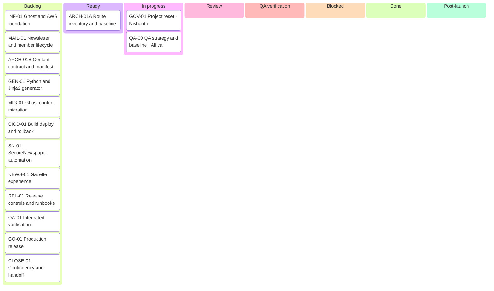

```mermaid
kanban
    backlog[Backlog]
        inf01[INF-01 Ghost and AWS foundation]
        mail01[MAIL-01 Newsletter and member lifecycle]
        arch01b[ARCH-01B Content contract and manifest]
        gen01[GEN-01 Python and Jinja2 generator]
        mig01[MIG-01 Ghost content migration]
        cicd01[CICD-01 Build deploy and rollback]
        sn01[SN-01 SecureNewspaper automation]
        news01[NEWS-01 Gazette experience]
        rel01[REL-01 Release controls and runbooks]
        qa01[QA-01 Integrated verification]
        go01[GO-01 Production release]
        close01[CLOSE-01 Contingency and handoff]

    ready[Ready]
        arch01a[ARCH-01A Route inventory and baseline]

    progress[In progress]
        gov01[GOV-01 Project reset · Nishanth]
        qa00[QA-00 QA strategy and baseline · Alfiya]

    review[Review]

    verification[QA verification]

    blocked[Blocked]

    done[Done]

    postlaunch[Post-launch]
```
